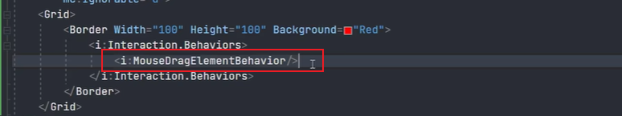
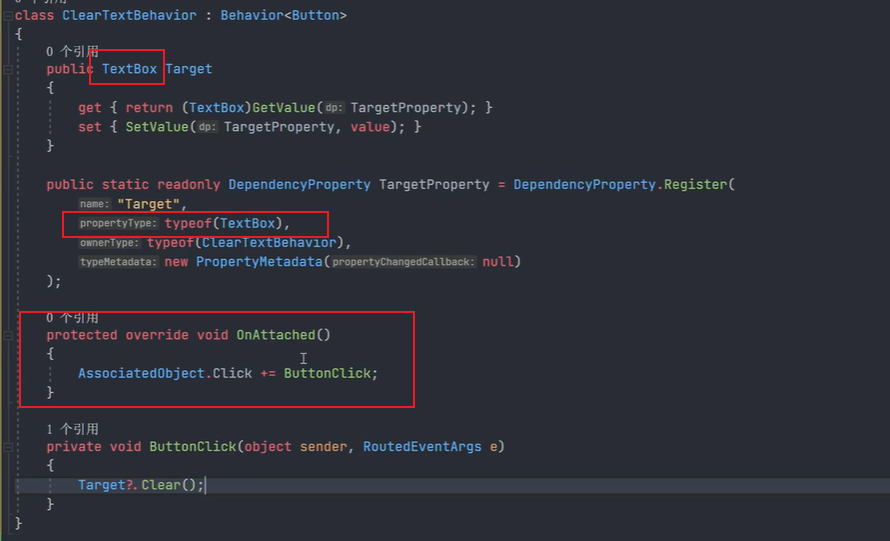
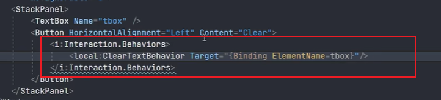
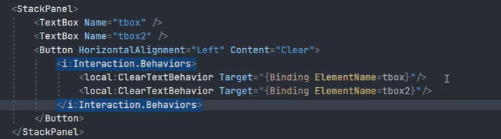
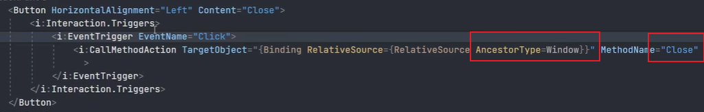
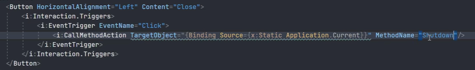
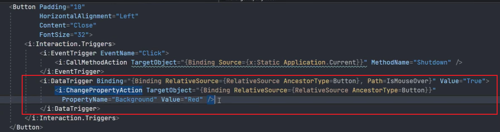

# Trigger（触发器）与 Behavior（行为）


## Trigger（WPF 原生触发器）

WPF中可以通过如下几个类的Triggers属性来设置触发器：

- Style.Triggers
- ControlTemplate.Triggers
- DataTemplate.Triggers

Triggers属性的定义都相同：

```csharp
public System.Windows.TriggerCollection Triggers { get; }
```

System.Windows.TriggerCollection表示触发器对象的集合，每个触发器对象都是派生自抽象类TriggerBase的具体类的实例。

```csharp
public sealed class TriggerCollection : System.Collections.ObjectModel.Collection<System.Windows.TriggerBase>
```

而派生自抽象类的TriggerBase的子类有：

- System.Windows.Trigger：属性触发器，允许基于属性值应用更改。
- System.Windows.MultiTrigger：根据多个属性的状态应用更改。
- System.Windows.EventTrigger：事件触发器，允许在事件发生时应用更改。
- System.Windows.DataTrigger：数据触发器，在绑定数据满足指定条件时应用属性值或执行操作。
- System.Windows.MultiDataTrigger：多重数据触发器。


属性触发器、事件触发器、数据触发器之间的区别：

- 属性触发器（Trigger）当不再满足触发条件时，触发器更改的属性会自动重置为其以前的值。
- EventTrigger 对象在发生指定的路由事件时启动一组 Actions，与  Trigger不同， EventTrigger 没有终止状态的概念，因此一旦引发事件的条件不再成立，操作将不会撤消。


[TriggerBase 类 (System.Windows) | Microsoft Learn](https://learn.microsoft.com/zh-cn/dotnet/api/system.windows.triggerbase?view=netframework-4.7.2)


## Interaction.Behaviors

Interaction中定义了Behaviors附加属性：

```csharp
private static readonly DependencyProperty BehaviorsProperty = DependencyProperty.RegisterAttached("ShadowBehaviors",                                                                            typeof(BehaviorCollection),
							typeof(Interaction),
                            new FrameworkPropertyMetadata(                                                                                        new PropertyChangedCallback(OnBehaviorsChanged)));
```

可以看到该附加属性的值是一个BehaviorCollection，也就是说每个控件可以添加多个行为，每个行为都是一个个单独的Behavior实例。

行为可以应用在模板中。

例如，利用行为快速实现一个拖动效果：



### Behavior（行为）

行为旨在封装一些UI功能，它是某些控件的共同特征的实现。相当于把通用的功能或操作进行包装，从而可以不必编写代码就能够将其应用到其他元素上。

- 行为本质上是基于Attached Property实现的
- 行为本身派生自DependencyObject

Behavior抽象类的定义：

```csharp
namespace Microsoft.Xaml.Behaviors
{
    using System;
    using System.Globalization;
    using System.Windows;
    using System.Windows.Media.Animation;

    public abstract class Behavior<T> : Behavior where T : DependencyObject
    {
        protected Behavior(): base(typeof(T))
        {
        }
        protected new T AssociatedObject
        {
            get { return (T)base.AssociatedObject; }
        }
    }

    public abstract class Behavior :Animatable,IAttachedObject
    {
        protected Type AssociatedType { get; }
        protected DependencyObject AssociatedObject { get; }
 
        public void Attach(DependencyObject dependencyObject);
        public void Detach();
        protected override Freezable CreateInstanceCore();
        protected virtual void OnAttached();
        protected virtual void OnDetaching();
    }
}
```

AssociatedObject属性：通过该属性访问放置行为的元素，这个属性通常表示一个控件，类型是DependencyObject（依赖对象），也就是说，我们写的行为要给某个控件使用的前提是，这个控件是一个DependencyObject（依赖对象）。

OnAttached()：这是一个虚方法，将来在行为中被重写，表示附加一个行为时（行为添加到控件时）要执行的业务逻辑。

OnDetaching()：这是一个虚方法，将来在行为中被重写，表示分离一个行为时要执行的业务逻辑。


### 定义行为

创建行为通常派生自Behavior<T>，然后重写OnAttached()和OnDetaching()方法，T表示要放置行为的元素的类型。

当调用OnAttached()方法时，可通过AssociatedObject属性访问放置行为的元素，并可关联事件处理程序。

当调用OnDetaching()方法时，移除事件处理程序。

示例，通过行为实现按钮清空文本框：



应用该行为：



行为可以被多次复用：




## Interaction.Triggers

这里的触发器指的不是WPF中原生的触发器，而是定义在 Interaction中的Triggers附加属性。

Interaction.Triggers 的定义如下

```csharp
private static readonly DependencyProperty TriggersProperty = DependencyProperty.RegisterAttached("ShadowTriggers",
	typeof(TriggerCollection),
    typeof(Interaction),
    new FrameworkPropertyMetadata(
    new PropertyChangedCallback(OnTriggersChanged)));
```

有点类似WPF的原生 Triggers，在触发某些条件时会发生一些变化，但是比原生Triggers更为灵活，可以做的事情也更多，通常与Action结合使用，常用的Action有：

- InvokeCommandAction：用于WPF中的事件和命令进行关联，多用于mvvm。
- ChangePropertyAction：原生的属性触发器的另一种写法，但不能自动撤销变化。
- CallMethodAction：调用指定对象的某个方法。


示例一，使用InvokeCommandAction将SelectionChanged事件与命令进行关联：

```xaml
xmlns:i="http://schemas.microsoft.com/xaml/behaviors"
<ListBox
    x:Name="menuBar"
    ItemContainerStyle="{StaticResource myListBoxItemsStyle}"
    ItemsSource="{Binding MenuBars}">
    <i:Interaction.Triggers>
        <i:EventTrigger EventName="SelectionChanged">
            <i:InvokeCommandAction Command="{Binding NavigateCommand}" CommandParameter="{Binding ElementName=menuBar, Path=SelectedItem}" />
        </i:EventTrigger>
    </i:Interaction.Triggers>
    <ListBox.ItemTemplate>
        <DataTemplate>
            <StackPanel Orientation="Horizontal">
                <materialDesign:PackIcon Margin="15,0" Kind="{Binding Icon}" />
                <TextBlock Margin="10,0" Text="{Binding Title}" />
            </StackPanel>
        </DataTemplate>
    </ListBox.ItemTemplate>
</ListBox>
```

示例二，使用CallMethodAction实现点击按钮关闭窗口：



上述代码等同于C#：`this.Close()`。

类似的可以直接访问Application对象：



示例三，ChangePropertyAction的应用：




## 行为相关的其他应用


### 行为结合附加事件实现页面绑定验证（重点）

自定义行为，ValidationErrorsBehavior.cs：

```csharp
public class ValidationErrorsBehavior : Behavior<FrameworkElement>
{
    public static readonly DependencyProperty ValidationErrorsProperty =
     DependencyProperty.Register(
         name: "ValidationErrors",
         propertyType: typeof(IList<ValidationError>), //属性使用的数据类型
         ownerType: typeof(ValidationErrorsBehavior),  //拥有该属性的类型
         typeMetadata: new PropertyMetadata(new List<ValidationError>()) //指定默认值
     );

    public IList<ValidationError> ValidationErrors
    {
        get { return (IList<ValidationError>)GetValue(ValidationErrorsProperty); }
        set { SetValue(ValidationErrorsProperty, value); }
    }

    public static readonly DependencyProperty HasValidationErrorProperty =
     DependencyProperty.Register(
         name: "HasValidationError",
         propertyType: typeof(bool), //属性使用的数据类型
         ownerType: typeof(ValidationErrorsBehavior),  //拥有该属性的类型
         typeMetadata: new PropertyMetadata(false) 
     );


    public bool HasValidationError
    {
        get { return (bool)GetValue(HasValidationErrorProperty); }
        set { SetValue(HasValidationErrorProperty, value); }
    }


    protected override void OnAttached()
    {
        base.OnAttached();
        //向指定的对象添加Error附加事件的事件处理程序
		//由于该行为用在了窗体本身，所以将会为窗体本身添加附加事件处理程序，通过在窗体中的控件上面进行事件冒泡，最终会触发该事件处理程序
        Validation.AddErrorHandler(this.AssociatedObject, OnValidationError);
    }

    protected override void OnDetaching()
    {
        base.OnDetaching();
        Validation.RemoveErrorHandler(this.AssociatedObject, OnValidationError);
    }

    private void OnValidationError(object? sender, ValidationErrorEventArgs e)
    {
        if (e.Action == ValidationErrorEventAction.Added)
        {
            this.ValidationErrors.Add(e.Error);
        }
        else
        {
            this.ValidationErrors.Remove(e.Error);
        }

        this.HasValidationError = this.ValidationErrors.Count > 0;
    }
}
```

UserRegistWindow.xaml：

```xaml
<Window.Resources>
    <ResourceDictionary>
        <vc:SexConverter x:Key="SexConvert" />
    </ResourceDictionary>
</Window.Resources>
<!--  监听整个Window的验证操作  -->
<i:Interaction.Behaviors>
    <rules:ValidationErrorsBehavior HasValidationError="{Binding IsInvalid, Mode=TwoWay, UpdateSourceTrigger=PropertyChanged}" />
</i:Interaction.Behaviors>
...

<TextBox
    Grid.Row="1"
    Grid.Column="1"
    Width="200"
    VerticalAlignment="Center"
    FontSize="16">
    <TextBox.Text>
        <Binding NotifyOnValidationError="True" Path="User.Mail">
            <Binding.ValidationRules>
                <rules:MailValidationRule />
            </Binding.ValidationRules>
        </Binding>
    </TextBox.Text>
</TextBox>
```

这里需要特别注意，要将Binding指定为NotifyOnValidationError="True"，表示在源更新过程中出现验证错误时应对绑定对象引发Error附加事件。

该示例完整代码见个人LearningTag项目。

