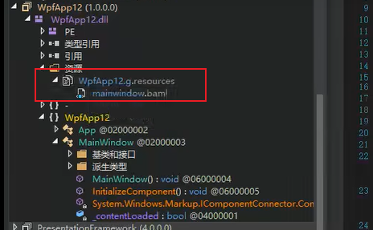

# XAML 介绍

XAML（读作 “zaml”）的全称是 Extensible Application Markup Language，即可扩展应用程序标记语言。

WPF项目中的程序入口为App.xml文件。

XAML文档最终被转换成BAML资源签入到DLL程序集当中，BAML为XAML的二进制形式，经过优化处理后，运行时更快解析。

可以通过反编译工具查看该文件的内容。



当创建窗口类的实例时，在调用InitializeComponent()方法的内部获取程序集当中的BAML资源，通过解析BAML控件对象，设置属性等。

示例：读取第三方程序集中的BAML资源文件核心代码


读取BAML的应用场景：

当需要切换界面主题的时候，可以通过该方式读取到其他BAML中的样式，从而实现主题的切换。


## XAML 语法

XAML 继承了 XML 的标签特点，使用 xmlns 特征来定义名称空间，xmlns 是 XML-Namespace 的缩写。

==XAML的标签声明的是对象，一个XAML标签会对应着一个对象。==这个对象一般是一个控件类的实例。

XAML的标签声明有以下2种标签形式：

1. 非空标签

   ```xaml
   <Tag Attribute1=Value1 Attribute2=Value2>Content</Tag>
   ```

2. 空标签

   ```xaml
   <Tag Attribute1=Value1 Attribute2=Value2/>
   ```

XAML 相关的名词描述：

- 标签：也称为元素，XAML使用标签声明一个元素，每个元素都对应内存中的一个对象。当你见到一个标签，就意味着声明了一个对象，对象之间的层级关系要么是并列，要么是包含，全都体现在标签的关系上。
- Attribute（特征）：指的是标签式语言中的标签特征，如上面语法中的Attribute1和Attribute2。
- Property（属性）：通常是针对对象而言，即对象的属性，通常表现为get/set访问器。注意：标签的 Attribute 与该标签对象的 Property 并不是完全映射的。通常一个标签所具有的Attribute多于它所代表的对象的Property。
- 属性元素：指的是某个标签下的一个元素对应这个标签的一个属性，即以元素的形式来表达一个实例的属性。也就是元素对应一个对象，如果该对象的某个属性又可以被声明为元素，则该元素为属性元素。形式为`<元素A.属性B>..</元素A.属性B>`，具体见下文。
- 标记扩展：为Attribute赋值时，使用花括号。具体见下文。
- 附加属性：子元素被附加上了父级元素的属性，如Grid.Row、Canvas.X、DockPanel.Dock等

如何将XAML标签的Attribute与对象的Property进行映射，参见文章末尾章节。


### XAML 引用名称空间

和C#代码一样，XAML也需要引入命名空间才可以使用内置的控件对象。C#代码中使用using，而XAML中使用xmlns特征。

XAML 继承了 XML 的标签特点，使用 xmlns 特征来定义名称空间，xmlns 是 XML-Namespace 的缩写。

xmlns 语法格式：

```
xmlns[:可选的映射前缀]="名称空间"
```

如果没有写可选映射前缀，那么名称空间将成为“默认名称空间”，XAML文件中的默认名称空间只能有一个，通常默认为`xmlns="http://schemas.microsoft.com/winfx/2006/xaml/presentation"`，WPF绘制UI相关的程序集都在该名称空间下。

XAML 中引用命名空间的语法：

```c#
xmlns:映射名="clr-namespace:类库中名称空间的名字;assembly=类库文件名（程序集名）"
```

例如，引入MyLibrary.dll中的两个名称空间：

```
xmlns:common="clr-namespace:WY.Common;assembly=MyLibrary"
xmlns:controls="clr-namespace:WY.Controls;assembly=MyLibrary"
```

映射名通常经验是使用类库中命名空间的原名或缩写。


### XAML 对象属性赋值语法

这里的属性不是完全指上文中的Attribute。当声明一个标签元素时，XAML编译器会为每个标签创建一个与之对应的对象，由于对象在创建出来之后需要对它的属性进行必要的初始化才有使用意义，所以在声明标签时，需要对该标签元素对象的某些属性进行初始化操作。有以下两种语法形式：

1. 使用字符串进行简单赋值
2. 使用属性元素（Property Element）进行复杂赋值。

#### 使用属性元素进行复杂赋值

属性元素指的是某个标签下的一个元素对应这个标签的一个属性，即以元素的实现来表达一个实例对象的属性。

```xaml
<ClassName>
	<ClassName.PropertyName>
    	<!-- 以对象形式为属性赋值-->
    </ClassName.PropertyName>
</ClassName>
```


### 标记扩展（Markup Extensions）语法

标记扩展是一种特殊的 Attribute=Value 语法，其特殊的地方在于Value字符串是由一对花括号及其括起来的内容组成。XAML编译器会对这样的内容做出解析，生成相应的对象。

示例：

```xaml
<TextBox Text="{Binding ElementName=wy1,Path=value,Mode=OneWay}" />
```

当编译器看到这句代码时，就会把花括号里的内容解析成相应的对象。对象的数据类型名是紧邻左花括号的字符串，对象的属性是由一串以逗号连接的子字符串负责初始化，注意：属性值不加引号。

记忆技巧，上述花括号的内容和实例化对象的语法很接近，区别仅在于XAML把对象的数据类型放在了花括号的里面。

```c#
new Binding{ElementName=wy1,Path=value,Mode=OneWay}
```

只有MarkupExtension类的派生类才能使用标记扩展语法来创建对象。

使用标记扩展需要注意以下几点：

- 标记扩展可以嵌套。例如：

  ```xaml
  <TextBox Text="{Binding Source={StaticResource MyDataSource},Path=PersonName}" />
  ```

- 标记扩展有一些简写语法，常见的有：

  - 固定位置参数简写，其实际上就是标记扩展类构造器的参数，其位置由构造器参数列表决定。例如：`{Bdinding Value}`与`{Binding Path=Value}`是等价的，对应的是Bding的唯一有参构造函数，参数名为path。`public Binding (string path);`
  - 具名参数简写，例如：`{StaticResource myString}`与`{StaticResource ResourceKey=myString}`是等价的。

- 标记扩展类的类名均以单词Extension为后缀，在XAML使用他们的时候Extension后缀可以省略不写，比如写`Text="{x:static}"`与`Text="{x:StaticExtension}"`是等价的。


## xaml:x 命名空间

x命名空间映射的是`xmlns:x="http://schemas.microsoft.com/winfx/2006/xaml"` ，它包含的类均与解析XAML语言相关。

与C#语言一样，XAML也有自己的编译器，XAML语言会被解析与编译，最终形成微软中间语言存储在程序集中。

x命名空间中包含的工具可以通过标记扩展、Attribute、指令元素这3种形式的使用出现在XAML中。

### 以Attribute形式使用的xaml:x工具

#### x:Class

告诉XAML编译器将XAML标签的编译结果与后台代码中指定的类合并。

- x:Class 只能用于根节点。
- x:Class 的值所指示的类型必须派生自 x:Class 所在的根节点的类型。
- x:Class 的值所指示的类型在声明时必须使用partial关键字。

#### x:ClassModifier

告诉XAML编译器由标签编译生成的类具有怎样的访问控制级别。

- 使用 x:ClassModifier 的标签必须指定x:Class，并且访问级别必须与x:Class所指示类的访问控制级别一致。

#### x:Name 与 x:FieldModifier

x:Name的作用有两个：

- 告诉XAML编译器，当一个标签带有x:Name时，除了为这个标签生成对应实例外还要为这个实例声明一个引用变量，变量名就是x:Name的值。
- 将XAML标签所对应对象的Name属性（如果有）也设为x:Name的值，并把这个值注册到UI树上，以方便查找。

x:FieldModifier用来设置元素的访问控制级别，默认为internal，当需要从一个程序集中访问其他程序集中的元素，就需要修改元素的访问级别。

==因为x:FieldModifier用来改变引用变量访问级别的==，**所以使用x:FieldModifier就必须使用x:Name**。

```xaml
<TextBox x:Name="txt1" x:FieldModifier="public" />
```

**XAML代码中应该使用Name 还是 x:Name？**

Name属性定义在FrameworkElement类中，这个类是WPF控件的基类，所以所有的WPF控件都具有Name这个属性，此时使用Name或x:Name效果是一样的。对于那些没有Name属性的元素，为了在XAML声明时也创建引用变量以便在C#代码中访问，就只能使用x:Name。因为x:Name的功能涵盖了Name属性的功能，所以全部使用x:Name以增强代码的统一性和可读性。

#### x:Key 与 x:Shared

x:Key的作用是为资源贴上用于检索的索引。

在WPF中，**几乎每个元素都有自己的Resources属性**，这个属性是个“Key-Value"式的集合，只要把元素放进这个集合，这个元素就成为资源字典中的一个条目，为了能够检索到这个条目，就必须为它添加x:Key，而为了控制每次检索到这个条目对象时是同一个对象还是新的副本，就需要指定x:Shared，如果值为true，表示每次检索到这个条目时，得到的都是同一个对象；如果值为false，表示每次检索到这个条目式，都是这个对象的一个新副本。XAML编译器会为资源隐藏地添加x:Shared=“true”，也就是说，默认情况下我们得到的都是同一个对象。

示例：

```xaml
<Window x:Class="StyleResourceSample.WpfApp.Sample4"
        xmlns="http://schemas.microsoft.com/winfx/2006/xaml/presentation"
        xmlns:x="http://schemas.microsoft.com/winfx/2006/xaml"
        xmlns:d="http://schemas.microsoft.com/expression/blend/2008"
        xmlns:mc="http://schemas.openxmlformats.org/markup-compatibility/2006"
        xmlns:local="clr-namespace:StyleResourceSample.WpfApp"
        xmlns:sys="clr-namespace:System;assembly=mscorlib"
        mc:Ignorable="d"
        Title="Sample4" Height="450" Width="800">
    <Window.Resources>
        <sys:String x:Key="myString">Hello！</sys:String>
    </Window.Resources>
    <StackPanel>
        <TextBox x:Name="txt1" Text="{StaticResource ResourceKey=myString}"/>
    </StackPanel>
</Window>
```

可以在C#代码中，通过调用一个拥有Resources属性的对象的FindResouce方法就可以在它的资源字典里检索资源。

下述代码效果和上述XAML表现的一致：

```c#
string str= this.FindResource("myString") as string;
this.txt1.Text=str;
```

说明：任何拥有Resources属性的对象都可以通过FindResouce方法来检索资源，不仅仅是当前窗体对象。


### 以标记扩展形式使用的xaml:x工具

上文中已经提到过，镖旗扩展（Markup Extension）实际上就是一些 MarkupExtension类的直接或间接派生类，x命名空间中就包含一些这样的类，以标记扩展的形式来使用。

#### x:Type

当在XAML中想表达某个数据类型时，就需要使用x:Type标记扩展。

示例：

```
MyType="{x:Type TypeName=local:CusType}"
```

可以简写为`MyType="{x:Type local:CusType}"`。

#### x:Null

如果一个属性具有默认值而我们又不需要这个默认值时就需要显式的设置null值了，在XAML中用来表示null值的是x:Null。

示例：

```xaml
<Button Content="OK" Style="{x:Null}" />
```

#### x:Array

x:Array 的作用就是通过它的Items属性向使用者暴露一个类型已知的ArrayList实例，ArrayList内成员的类型由x:Array 的Type指明。

下述代码只用来展示x:Array的用法，非绑定标准做法，数据绑定参见binding的使用。

```xaml
<Window x:Class="WpfApp.MainWindow"
        xmlns="http://schemas.microsoft.com/winfx/2006/xaml/presentation"
        xmlns:x="http://schemas.microsoft.com/winfx/2006/xaml"
        xmlns:d="http://schemas.microsoft.com/expression/blend/2008"
        xmlns:mc="http://schemas.openxmlformats.org/markup-compatibility/2006"
        xmlns:local="clr-namespace:WpfApp"
        xmlns:sys="clr-namespace:System;assembly=mscorlib"
        mc:Ignorable="d"
        Title="MainWindow" Height="450" Width="800">
    <Grid>
        <ListBox ItemsSource="{x:Array Type=sys:String}"/>
    </Grid>
</Window>
```

上述代码中，作为数据源的x:Array实例没有数据可提供的，为了在XAML中进行初始化数据，可以改用标签声明语法：

```xaml
<ListBox>
    <ListBox.ItemsSource>
        <x:Array Type="sys:String">
            <sys:String>张三</sys:String>
            <sys:String>李四</sys:String>
            <sys:String>王五</sys:String>
        </x:Array>
    </ListBox.ItemsSource>
</ListBox>
```

#### x:Static

用于在XAML中访问C#代码中定义的static成员。

```xaml
<TextBlock Text="{x:Static local:MainWindow.WY}"/>
```

注意：即使是在当前窗体代码中定义了静态成员，在XAML中访问时，依然要指明完整的包含类名的静态成员名称。

### 以指令元素形式使用的xaml:x工具

#### x:Code

用于在XAML中嵌入C#代码，不推荐使用，会使代码不易调试和维护。

示例：

```xaml
<Grid>
    <TextBlock Text="{x:Static local:MainWindow.WY}"/>
</Grid>
<x:Code>
    <![CDATA[
          //可以写任何的C#代码
          public static string WY = "nihao";
    ]]>
</x:Code>
```

#### x:XData

WPF中把包含数据的对象称为数据源，用于把数据源中的数据提供给数据使用者的对象称为数据提供者（Data Provider）。

WPF类库中包含多种数据提供者，其中有一个类叫XmlDataProvider，专门用于提供XML化的数据。

如果想在XML里声明一个带有数据的XmlDataProvider实例，那么XmlDataProvider实例的数据就要放在x:XData标签的内容里。

x:XData标签是一个专用标签，这里只展示用法。

```xaml
<Window.Resources>
  <XmlDataProvider x:Key="MyData" XPath="/Books">
      <x:XData>
          <BookNames>
              <One Name="语文"/>
              <Two Name="数学"/>
          </BookNames>
      </x:XData>
  </XmlDataProvider>
</Window.Resources>
```


## 补充

使用TypeConverter 类将XAML标签的Attribute与对象的Property进行映射，参见：

- 《深入浅出WPF》P19中的3.2.2章节。
- 《WPF编程宝典》P25中的2.3.1章节。 
- 编辑C#代码生成exe、dll，使用C#编译工具csc命令。


## 总结

- XAML中的一个标签，在调用InitializeComponent()方法之后，相当于定义了一个该标签的实例，而x:Name相当于为该实例声明了一个引用变量，变量名为x:Name的值。
- 应该为标签始终使用x:Name而不是Name来指定变量名称。因为Name属性派生自FrameworkElement，而其他非WPF控件类型不包含Name属性，而只能使用x:Name。
- 由于XAML中的一个标签可以看作是定义了一个实例，因此除了WPF的控件可以作为标签之外，其他任何的类类型都可以作为标签写在XAML中，只需要使用xmlns引入该类型的命名空间即可。


---

References:

- 《深入浅出WPF》
- 《C#码农笔记-WPF应用程序》

Last updated：2025-04-04

