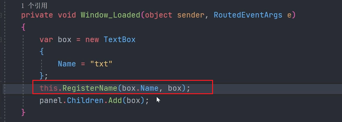

# WPF技巧代码片段积累


### 布局技巧

- Grid内部的子元素，默认是层叠展示的，如果设置子元素的HorizontalAlignment为left或者Right，就可以实现DockPanel一样的左端或右端停靠效果。

  


### 修改WPF控件默认系统样式

需要借助模板来实现：

```XAML
<ListBox BorderThickness="0">
    <ListBox.ItemContainerStyle>
        <Style TargetType="ListBoxItem">
            <!--让ListBoxItem的内容都填充每一项的空间-->
            <Setter Property="HorizontalContentAlignment" Value="Stretch"/>
            <Setter Property="Height" Value="30"/>
            <Setter Property="Template">
                <Setter.Value>
                    <!--移除ListBox系统默认的鼠标悬浮样式-->
                    <ControlTemplate TargetType="{x:Type ListBoxItem}">
                        <ContentPresenter/>
                    </ControlTemplate>
                </Setter.Value>
            </Setter>
        </Style>
    </ListBox.ItemContainerStyle>
    
    <RadioButton>
        <DockPanel LastChildFill="False">
            <TextBlock Text="&#xe635;" Style="{StaticResource iconStyle}" />
            <TextBlock Text="sdfsd"/>
            <TextBlock Text="2" DockPanel.Dock="Right"/>
        </DockPanel>
    </RadioButton>
</ListBox>
```

### 鼠标移动到控件上和选择该控件的样式触发器实现

```xaml
<Style TargetType="RadioButton">
    <Setter Property="VerticalContentAlignment" Value="Center"/>
    <Setter Property="Template">
        <Setter.Value>
            <ControlTemplate TargetType="{x:Type RadioButton}">
                <!--此处一定要将Grid设置为背景透明，否则只有移动到字体上面才会改变背景颜色-->
                <Grid Background="Transparent">
                    <!--border默认会填充整个Grid，因此可以作为背景元素来使用-->
                    <Border x:Name="border_back" />
                    <Border x:Name="border_thick" />
                    <ContentPresenter />
                </Grid>

                <ControlTemplate.Triggers>
                    <Trigger Property="IsMouseOver" Value="True">
                        <Setter Property="Background" Value="#e0daff" TargetName="border_back"/>
                    </Trigger>
                    <Trigger Property="IsChecked" Value="True">
                        <Setter Property="Foreground" Value="Blue"/>
                        <Setter Property="FontWeight" Value="Bold"/>
                        <!--设置纯颜色背景与透明度-->
                        <Setter Property="Background" Value="Red" TargetName="border_back"/>
                        <Setter Property="Opacity" Value="0.1" TargetName="border_back"/>
                        <Setter Property="BorderThickness" Value="5 0 0 0" TargetName="border_thick"/>
                        <Setter Property="BorderBrush" Value="Red" TargetName="border_thick"/>
                    </Trigger>
                </ControlTemplate.Triggers>
            </ControlTemplate>
        </Setter.Value>
    </Setter>
</Style>
```

### 数据绑定时使用`ObservableCollection<T>`代替`List<T>`


### 使用行为实现控件事件与命令的关联

```xaml
xmlns:i="http://schemas.microsoft.com/xaml/behaviors"
<ListBox
    x:Name="menuBar"
    ItemContainerStyle="{StaticResource myListBoxItemsStyle}"
    ItemsSource="{Binding MenuBars}">
    <i:Interaction.Triggers>
        <i:EventTrigger EventName="SelectionChanged">
            <i:InvokeCommandAction Command="{Binding NavigateCommand}" CommandParameter="{Binding ElementName=menuBar, Path=SelectedItem}" />
        </i:EventTrigger>
    </i:Interaction.Triggers>
    <ListBox.ItemTemplate>
        <DataTemplate>
            <StackPanel Orientation="Horizontal">
                <materialDesign:PackIcon Margin="15,0" Kind="{Binding Icon}" />
                <TextBlock Margin="10,0" Text="{Binding Title}" />
            </StackPanel>
        </DataTemplate>
    </ListBox.ItemTemplate>
</ListBox>
```

### DataTemplate和ControlTemplate的组合使用

```xaml
<ListBox BorderThickness="0" ItemsSource="{Binding MenuItems}">
    <ListBox.ItemContainerStyle>
        <Style TargetType="ListBoxItem">
            <!--让ListBoxItem的内容都填充每一项的空间-->
            <Setter Property="HorizontalContentAlignment" Value="Stretch"/>
            <Setter Property="Height" Value="30"/>
            <Setter Property="Template">
                <Setter.Value>
                    <!--移除ListBox系统默认的鼠标悬浮样式-->
                    <ControlTemplate TargetType="{x:Type ListBoxItem}">
                        <Grid Background="Transparent">
                            <Border x:Name="bd1"/>
                            <Border x:Name="bd2"/>
                            <ContentPresenter/>
                        </Grid>
                        <ControlTemplate.Triggers>
                            <Trigger Property="IsMouseOver" Value="True">
                                <Setter TargetName="bd1" Property="Background" Value="#ff99ff"/>
                            </Trigger>
                            <Trigger Property="IsSelected" Value="True">
                                <Setter Property="Foreground" Value="{Binding BackColor}"/>
                                <Setter Property="FontWeight" Value="Bold"/>
                                <!--设置纯颜色背景与透明度-->
                                <Setter Property="Background" Value="{Binding BackColor}" TargetName="bd1"/>
                                <Setter Property="Opacity" Value="0.1" TargetName="bd1"/>
                                <Setter Property="BorderThickness" Value="5 0 0 0" TargetName="bd2"/>
                                <Setter Property="BorderBrush" Value="{Binding BackColor}" TargetName="bd2"/>
                            </Trigger>

                        </ControlTemplate.Triggers>

                    </ControlTemplate>
                </Setter.Value>
            </Setter>
        </Style>
    </ListBox.ItemContainerStyle>

    <!--左侧菜单进行数据绑定-->
    <ListBox.ItemTemplate>
        <DataTemplate>
            <DockPanel LastChildFill="False" Margin="10 0 0 0">
                <TextBlock Text="{Binding Icon}" Style="{StaticResource iconStyle}" />
                <TextBlock Text="{Binding Name}"/>
                <TextBlock Text="{Binding Count}" DockPanel.Dock="Right"/>
            </DockPanel>
        </DataTemplate>
    </ListBox.ItemTemplate>
</ListBox>
```


### 使用x:Reference 引用界面元素实现绑定

不能使用x:Reference绑定自己的父级。

当更改文本框中的内容时，表头的列名跟着变化：

```xaml
<TextBox Name="txt" />
<DataGrid>
	<DataGrid.Columns>
    	<DataGridTextColumn Header="{Binding Source={x:Reference Name=txt}, Path=Text}"/>
    </DataGrid.Columns>
</DataGrid>
```


### 文本框内容动态变化触发ViewModel响应

不应该使用类似winform中的TextChanged事件，而是通过绑定的方式，在ViewModel中进行处理。XAML中需要指定UpdateSourceTrigger=PropertyChanged：

```xaml
<TextBox Text="{Binding Name, UpdateSourceTrigger = PropertyChanged}"/>
```


### C#程序添加控件时，需要显式注册到可视化树中


