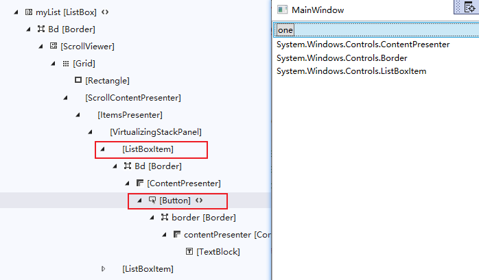

# 控件与布局

WPF中是数据驱动UI，数据是核心、是主动的；UI从属于数据并表达数据、是被动的。


## 控件

WPF把那些能够展示数据、响应用户操作的UI元素称为控件（Control）。控件所展示的数据，我们称之为控件的“数据内容”；控件在响应用户的操作后会执行自己的一些方法或以事件（Event）的形式通知应用程序（开发者可以决定如何处理这些事件），我们称之为控件的“行为”或“算法内容”。

在WPF中谈控件，我们关注的应该是抽象的数据和行为而不是控件具体的形象。

WPF的控件都派生自FrameworkElement，这里的“Framework”指的是WPF Framework，它是在UIElement类的基础上添加了很多专门用于WPF开发的API，所以从这个类开始才算是进入WPF开发框架。

### 内容属性

控件相当于一个容器，容器里装的东西就是它的内容。控件的内容可以直接是数据，也可以是控件。

控件是内存中的对象，控件的内容也是内存中的对象。控件通过自己的某个属性引用着作为其内容的对象，这个属性称为**内容属性**（Content Property）。

“内容属性”是个统称，不同控件的内容属性的名称也不相同，如Button的内容属性是Content；StackPanel的内容属性是Children；ListBox的内容属性是Items。

```xaml
<StackPanel>
    <StackPanel.Children>
        <ListBox>
            <ListBox.Items>
                <ListBoxItem>记录1</ListBoxItem>
                <ListBoxItem>记录1</ListBoxItem>
            </ListBox.Items>
        </ListBox>
    </StackPanel.Children>
</StackPanel>
```

按照对标签语言的理解，控件的内容就应该是标签的内容、子级控件就应该是标签的子级元素，标签的内容是夹在起始标签和结束标签间的代码。换句话说，XAML标签的内容区域（起始标签和结束标签间的部分）专门映射了控件的内容属性，因此为具有内容属性的控件添加内容时，可以直接省略内容属性标签。上述代码可以直接简化为：

```xaml
<StackPanel>
    <ListBox>
        <ListBoxItem>记录1</ListBoxItem>
        <ListBoxItem>记录1</ListBoxItem>
	</ListBox>
</StackPanel>
```

标签元素按照内容属性和共同基类可以分为下述几大类。


### ContentControl

这类元素的特点：

- 均派生自ContentControl类。
- 它们都是Control。
- 内容属性的名称为Content。
- 只能由单一元素充当其内容（只能接受一个元素作为它的Content，如果有多个元素可以使用容器控件包裹起来）。

ContentControl包含的控件：

| Button | ToolTip | ButtonBase | GroupItem | ComboBoxItem | NavigationWindow | ListBoxItem |
| ---- | ---- | ---- | ---- | ---- | ---- | ---- |
|   Frame   |   CheckBox   |   UserControl   |   RadioButton   | ContentControl | GridViewColumnHeader | ListViewItem |
| Label | Window | RepeatButton | ToggleButton | ScrollViewer | StatusBarItem |  |


### HeaderedContentControl

这类元素的特点：

- 它们都派生自HeaderedContentControl类，HeaderedContentControl是ContentControl类的派生类。
- 他们都是Control，用于显示带标题的数据。
- 除了用于显示主体内容的区域外，控件还具有一个显示标题（Header）的区域。
- 内容属性为Content和Header。
- 无论是Content还是Header都只能容纳一个元素作为其内容。

HeaderedContentControl包含的控件：

| HeaderedContentControl | GroupBox | Expander | TabItem |
| ---------------------- | -------- | -------- | ------- |

```xaml
<GroupBox BorderBrush="Gray">
    <GroupBox.Header>标题部分</GroupBox.Header>
    <GroupBox.Content>
        <TextBlock Text="内容部分"/>
    </GroupBox.Content>
</GroupBox>
```

备注：上述代码中的内容属性标签GroupBox.Content可省略不写。


### ItemsControl

这类元素的特点：

- 均派生自ItemsControl
- 它们都是Control，用于显示列表化的数据
- 内容属性为Items或ItemsSource
- 每种ItemsControl都对应有自己的条目容器（Item Container），并且会自动使用条目容器对内容进行包装。

ItemsControl包含的控件：

| ItemsControl | MenuBase   | ComboBox | ListBox  | Menu     | StatusBar |
| ------------ | ---------- | -------- | -------- | -------- | --------- |
| ContextMenu  | TabControl | TreeView | ListView | Selector |           |

#### ItemsControl的自动包装

ItemsControl这类控件会自动使用条目容器对其内容进行包装。合法的 ItemsControl 内容一定是个集合，当我们把这个集合作为内容提交给ItemsControl时，ItemsControl不会把这个集合直接拿来用，而是使用自己对应的条目容器把集合中的条目逐个包装，然后再把包装好的条目序列当作自己的内容。

不同ItemsControl对应的Item Container：

| ItemsControl 名称 | 对应的 Item Container |
| ----------------- | --------------------- |
| ComboBox          | ComboBoxItem          |
| ContextMenu       | MenuItem              |
| ListBox           | ListBoxItem           |
| ListView          | ListViewItem          |
| Menu              | MenuItem              |
| StatusBar         | StatusBarItem         |
| TabControl        | TabItem               |
| TreeView          | TreeViewItem          |

#### ListBox

这里以ListBox为例来说明自动包装的影响情况。

```xaml
<ListBox x:Name="myList">
    <Button Content="one" Click="Button_Click"/>
</ListBox>
```

C#代码：

```c#
private void Button_Click(object sender, RoutedEventArgs e)
{
    var btn = sender as Button;
    DependencyObject parent1 = VisualTreeHelper.GetParent(btn);
    myList.Items.Add(parent1.GetType().ToString());
     DependencyObject parent2 = VisualTreeHelper.GetParent(parent1);
    myList.Items.Add(parent2.GetType().ToString());
    DependencyObject parent3 = VisualTreeHelper.GetParent(parent2);
    myList.Items.Add(parent3.GetType().ToString());
}
```

运行效果和实时可视化树如下图所示：



无论XAML中写ListBox的内容如何简洁，最终都会使用ListBoxItem进行包装数据。


### HeaderedItemsControl

这类元素除了具有ItemsControl的特性外，还具有显示标题的能力。

这类元素的特点：

- 均派生自 HeaderedItemsControl类
- 他们都是Control，用于显示列表化的数据，同时可以显示一个标题。
- 内容属性为Items、ItemsSource和Header

HeaderedItemsControl控件有3个：MenuItem、TreeViewIItem、ToolBar。


### Decorator

这类元素在UI上起到装饰效果。

这类元素的特点：

- 均派生自Decorator类
- 起到UI装饰作用
- 内容属性为Child
- 只能由单一元素充当内容

Decorator类元素有：

| Border  | ButtonChrome    | ListBoxChrome | SystemDropShadowChrome | AdornerDecorator |
| ------- | --------------- | ------------- | ---------------------- | ---------------- |
| Viewbox | BulletDecorator | InkPresenter  | ClassicBorderDecorator |                  |


### TextBlock 和 TextBox

TextBlock只能显示文本，并且可以使用丰富的印刷级的格式控制标记显示专业的排版效果。

TextBlock由于需要操纵格式，所以内容属性是Inlines（印刷中的“行”），而不是Text，Text用于简单显示一个字符串。


### Shape

这类元素专门用来在UI上绘制图形，注意：它们只是简单的视觉元素，不是控件。

这类元素的特点：

- 均派生自Shape类
- 用于2D图形绘制
- 无内容属性，也就意味着没有自己的内容
- 使用Fill属性设置填充效果
- 使用Stroke属性设置边线效果


### Panel

这类元素用于UI布局，接下来会讲布局。

这类元素特点：

- 均派生自Panel抽象类
- 主要功能是控制UI布局
- 内容属性为Children
- 内容可以是多个元素，Panel元素将控制它们的布局

这类元素包括：

| StackPanel | TabPanel  | ToolBarPanel | VirtualizingPanel      | Canvas | ToolBarOverflowPanel |
| ---------- | --------- | ------------ | ---------------------- | ------ | -------------------- |
| DockPanel  | WrapPanel | UniformGrid  | VirtualizingStackPanel | Grid   |                      |


## 布局

WPF中的布局元素有如下几个：

- Grid：网格。可以自定义行和列并通过行列的数量、行高和列宽来调整控件的布局。类似于HTML中的Table。
- StackPanel：栈式面板。可将包含的元素在竖直或水平方向上排成一条直线，当移除一个元素后，后面的元素会自动向前移动以填充空缺。
- Canvas：画布。内部元素可以使用以像素为单位的绝对坐标进行定位，类似于winForm编程的布局方式。
- DockPanel：泊靠式面板，内部元素可以选择泊靠方向，类似于Winform编程中设置控件的Dock属性。
- WrapPanel：自动折行面板。内部元素在排满一行后能够自动折行，类似于HTML中的流式布局。


### Grid

Grid元素会以网格的形式对内容元素们进行布局。

Grid特点：

- 可以定义任意数量的行和列
- 行的高度和列的宽度可以使用绝对数值、相对比例或自动调整的方式进行精确设定，并可设置最大和最小值。
- 内部元素可以设置自己所在的行和列，还可以设置跨几行跨几列。
- 可以设置Children元素的对齐方向。

#### 高度和宽度

Grid可接受的宽度和高度的单位：

| 英文名称   | 中文名称 | 简写                   | 换算               |
| ---------- | -------- | ---------------------- | ------------------ |
| Pixel      | 像素     | px（默认单位，可省略） | 图形基本单位       |
| Inch       | 英寸     | in                     | 1inch=96pixel      |
| Centimeter | 厘米     | cm                     | 1cm=(96/2.54)pixel |
| Point      | 点       | pt                     | 1pt=(96/72)pixel   |

```xaml
<Grid>
    <Grid.RowDefinitions>
        <RowDefinition Height="30px"/>
        <RowDefinition Height="30" />
        <RowDefinition Height="0.5in"/>
        <RowDefinition Height="1cm"/>
        <RowDefinition Height="30pt"/>
    </Grid.RowDefinitions>
</Grid>
```

不同单位的使用场景：

- 只用于显示在计算机屏幕上，像素单位最合适
- 涉及到打印输出，则公制单位选择厘米、英制单位使用英寸比较合适。

行高和列宽可以设置三类值：

1. 绝对值：double数值加单位后缀（如上述代码）
2. 比例值：double数值后加一个星号（*）。解析器会把所有比例值的数值加起来作为分母、把每个比例值的数值作为分子，再用这个分数值乘以未被占用空间的像素数，得到的结果就是分配给这个比例值的最终像素数。
3. 自动值：字符串Auto。此时行高或列宽的实际值由行列内控件的高度和宽度决定。如果行列中没有控件，则行高和列宽均为0。

如果把两个元素放在Grid的同一个单元格内，则代码中后书写的元素将盖在先书写的元素之上。如果想让盖在后面的元素显示出来，可以把上面的元素的Visibility设置为Hidden或Collapsed，也可以把上面的元素的Opacity属性设置为0。

### StackPanel

StackPanel 可以把内部元素在纵向或横向上紧凑排列，形成栈式布局。当把排在前面的积木块抽掉之后排在它后面的元素会整体向前移动、补占原有元素的空间。

StackPanel适用场景：

- 同类元素需要紧凑排列
- 移除其中的元素后能够自动补缺的布局或动画。


### Canvas

使用Canvas布局与在Winform窗体上布局基本是一样的，Winform中通过Left和Top等属性控制位置，而在Canvas中，是通过内容元素的附加属性Canvas.X和Canvas.Y来设置绝对坐标进行定位的。

Canvas适用场景：

- 一经设计基本不会再有改变的小型布局（如图标）
- 艺术性比较强的布局
- 需要大量使用横纵坐标进行绝对定位的布局
- 依赖于横纵坐标的动画

与Grid一样，如果两个元素在Canvas内部占据相同的位置，亦是代码中后书写的元素会覆盖在先书写的元素之上。想要显示盖在下面的元素，可以设置上面元素的Visibility属性值或Opacity属性值。


### DockPanel

DockPanel内的元素会被附加上DockPanel.Dock这个属性，这个属性的数据类型为Dock枚举，分别为Left、Top、Right和Bottom四个值。

DockPanel有一个重要属性，Bool类型的LastChildFill，默认值为true。当LastChildFill 属性值为true时，DockPanel内最后一个元素的DockPanel.Dock属性值将会被忽略，这个元素会把DockPanel内部所有剩余空间充满。这也正好解释了为什么Dock枚举类型没有Fill这个值。


### WrapPanel

wrapPanel内部采用流式布局。

WrapPanel使用Orientation属性来控制流延伸的方向，使用HorizontalAlignment和VerticalAlignment两个属性控制内部空间的对齐，在流延伸的方向上，WrapPanel会排列尽可能多的控件，排不下的控件将会新起一行或一列继续排列。


----

References:

- 《深入浅出WPF》
- 《C#码农笔记-WPF应用程序》

Last updated：2025-04-04
