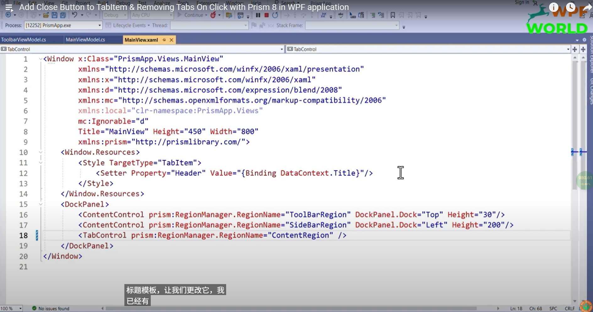
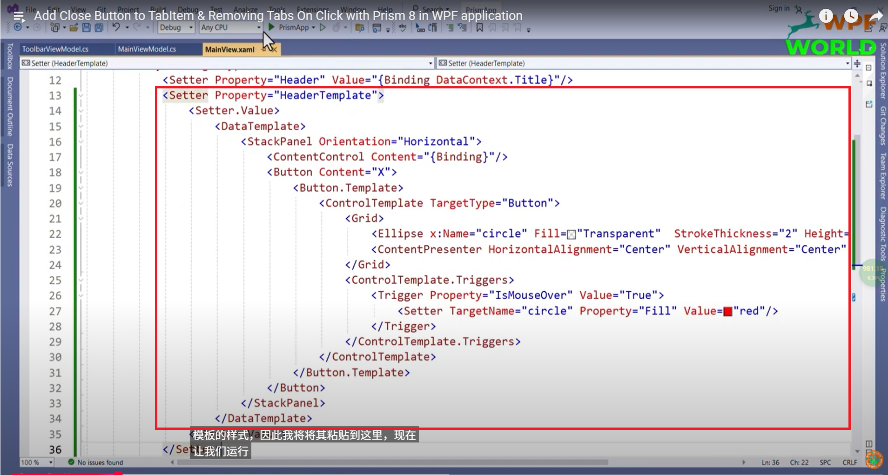
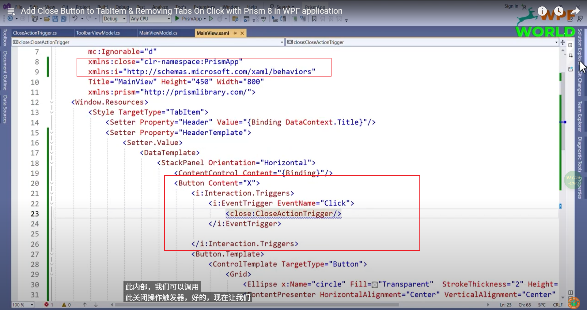
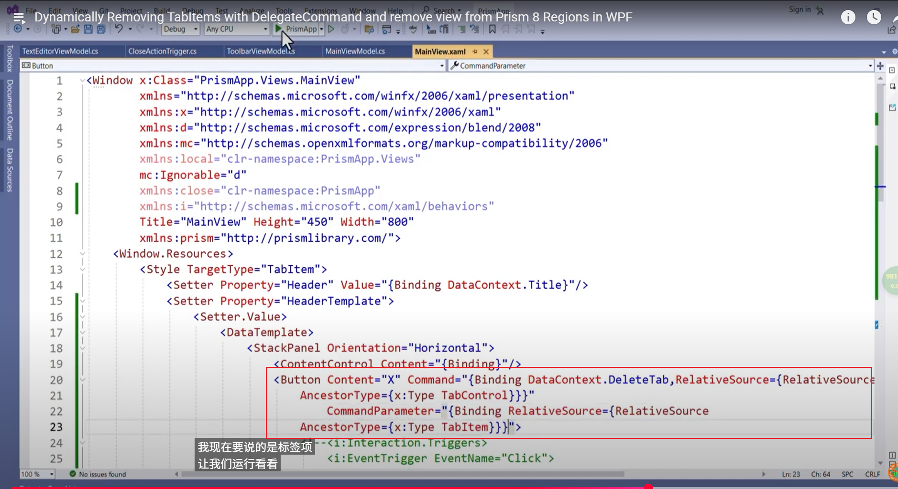

# 自定义TriggerAction

来源：[Dynamically Removing TabItems with DelegateCommand and remove view from Prism 8 Regions in WPF](https://www.youtube.com/watch?v=Uybz708IFQw&list=PLl0ZDeqSI5YmjBhIJ4tmy6TlyYFUpXeRB&index=11)

向Tabitem添加关闭按钮和删除标签页

MainView.xaml：

更好的做法是使用命令：

